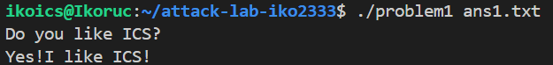
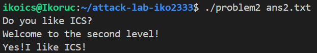
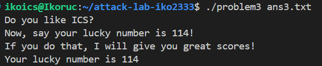
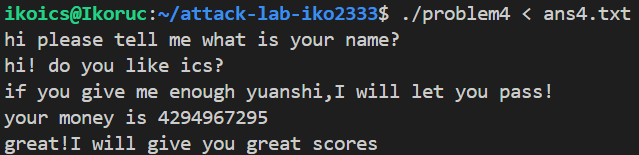

# 栈溢出攻击实验

## 题目解决思路

### Problem 1: 
- **分析**：
先分析main函数：
先 puts打印一段提示，再检查参数个数 argc == 2（否则 fprintf(stderr, "usage...") 并返回）；
fopen(argv[1], "r") 打开payload 文件，fread(buf, 1, 0x100, fp) 把最多 256 字节读入 main 的栈上缓冲区 buf，并手动在末尾补 '\0'（保证是 C 字符串），然后调用 func(buf)。

分析漏洞函数 func，在该函数中：
局部变量缓冲区位于 rbp-0x8，大小为 8 字节；
程序调用了 不检查长度的 strcpy，将用户输入拷贝到该缓冲区中；
当输入长度超过 8 字节时，会依次覆盖：局部缓冲区[rbp-8]、保存的 rbp[rbp+0]、retaddr[rbp+8]。
我们希望覆盖retaddr，最终调用函数 func1，其功能是直接输出字符串"Yes!I like ICS!"并调用 exit(0) 结束程序。

设计payload：
由于 strcpy 在遇到 0x00 字节时会停止拷贝，而 64 位地址写全 8 字节时高字节通常包含 0x00，因此采用部分返回地址覆盖的方式，即仅覆盖返回地址的低 3 个字节。
比较原地址0x401362和希望返回的地址0x401216，发现只要把返回地址的低 3 个字节改成 16 12 40即可。
即我需要让栈上布局变成：
前 16 字节：随便填（只要避免 0x00），用于覆盖 dst(8) 和 saved rbp(8)；
接下来 3 字节：写入返回地址低 3 字节：\x16\x12\x40；
然后结束（让 strcpy 自动补 \x00）。
- **解决方案**：（payload是什么，即你的python代码or其他能体现你payload信息的代码/图片）
bash -c 'echo -ne "AAAAAAAAAAAAAAAA\x16\x12\x40" > ans1.txt'
- **结果**：附上图片

### Problem 2:
- **分析**：
分析main函数，发现与 Problem1 基本一致。
分析漏洞函数 func，观察到如下行为：
函数在栈上为局部变量分配空间；使用 memcpy(dst, src, 0x38) 将固定长度 56 字节的数据从用户输入拷贝到栈上的局部缓冲区；该局部缓冲区的实际大小小于 56 字节，因此必然发生栈溢出。
与 Problem1 不同的是，这里使用的是 memcpy，不会因为 0x00 字节而提前终止拷贝。
当 memcpy 执行时，溢出会依次覆盖：局部缓冲区、保存的 rbp、retaddr。

分析目标函数 func2(int x)，其逻辑为：
当且仅当参数 x == 0x3f8 时；调用 puts 输出字符串 "Yes!I like ICS!"，并调用 exit(0) 结束程序。

由于 Nxenabled 保护，栈不可执行，无法采用 Problem1 的方案。
因此，必须使用 ROP。发现程序中有这样两行汇编代码：
pop rdi
ret
考虑利用这个控制func2的参数。

设计 payload：
我们希望覆盖返回地址，使其跳转到 pop rdi; ret；
然后在栈上布置参数值 0x3f8，并再次返回，跳转到 func2。
最终栈布局为：
前 16 字节：填充数据，覆盖局部缓冲区与旧 rbp；
接下来 8 字节：pop rdi; ret 的地址；
接下来 8 字节：参数 0x3f8；
接下来 8 字节：func2 的地址。
这样即可在不执行栈代码的前提下，成功调用 func2(0x3f8)。

- **解决方案**：（payload是什么，即你的python代码or其他能体现你payload信息的代码/图片）
bash -c 'echo -ne  "AAAAAAAAAAAAAAAA\xc7\x12\x40\x00\x00\x00\x00\x00\xf8\x03\x00\x00\x00\x00\x00\x00\x16\x12\x40\x00\x00\x00\x00\x00BBBBBBBBBBBBBBBB" > ans2.txt'

- **结果**：附上图片

### Problem 3: 
- **分析**：
main 函数与前两问基本一致，func 函数与第二问基本一致。
在程序中发现了一个特殊函数jmp_xs，其核心功能为：jmp *(saved_rsp + 0x10)，而 saved_rsp + 0x10 正好对应用户输入缓冲区在栈中的起始位置。
这意味着：即使不知道具体的栈地址，也可以通过该函数间接跳转回输入缓冲区。

设计 payload：
在输入缓冲区开头放置一段 shellcode、将返回地址覆盖为 jmp_xs，即可实现：jmp_xs 执行后，程序跳转到 shellcode，shellcode 设置参数并调用 func1(114)，输出幸运数字。
最终 payload 布局为：
5字节设置 edi = 114，10字节把 func1 地址放入 rax ，2 字节调用 func1）；
15字节 NOP sled（凑对齐，满32字节）；
8字节，覆盖 retaddr 为 jmp_xs 的地址 0x401334；
尾部剩余16字节随便填充。
总之就是利用程序本身提供的跳板函数，以规避栈地址不确定的问题。

- **解决方案**：（payload是什么，即你的python代码or其他能体现你payload信息的代码/图片）
bash -c 'echo -ne "\xbf\x72\x00\x00\x00\x48\xb8\x16\x12\x40\x00\x00\x00\x00\x00\xff\xd0\x90\x90\x90\x90\x90\x90\x90\x90\x90\x90\x90\x90\x90\x90\x90\x90\x90\x90\x90\x90\x90\x90\x90\x34\x13\x40\x00\x00\x00\x00\x00DDDDDDDDDDDDDDDD" > ans3'
- **结果**：附上图片

### Problem 4: 
- **分析**：（体现canary的保护机制是什么）
Stack Canary 保护机制：
在函数入口处，从 fs:0x28 读取 canary 值，并将该值保存到栈上的固定位置；
在函数返回前，再次取出该值并与原始 canary 比较；
若不一致，则调用 __stack_chk_fail，程序直接异常终止。
这意味着任何试图覆盖返回地址的栈溢出攻击都会破坏 canary，攻击在返回前即被检测并阻止。

发现漏洞函数：
程序通过 scanf 从标准输入读取两次字符串输入和一次整数输入，发现后者可能循环读取！
通过分析条件判断逻辑可知：
当整数参数取值为 -1（即 0xffffffff）时，程序会直接进入成功分支，调用 func1 输出通关提示信息。
- **解决方案**：（payload是什么，即你的python代码or其他能体现你payload信息的代码/图片）
bash -c 'echo -e "hjn\nyes\n-1\n" > ans4.txt'
- **结果**：附上图片

## 思考与总结
比linklab有意思，好玩的！
对栈的理解也更深入了。

## 参考资料

列出在准备报告过程中参考的所有文献、网站或其他资源，确保引用格式正确。
